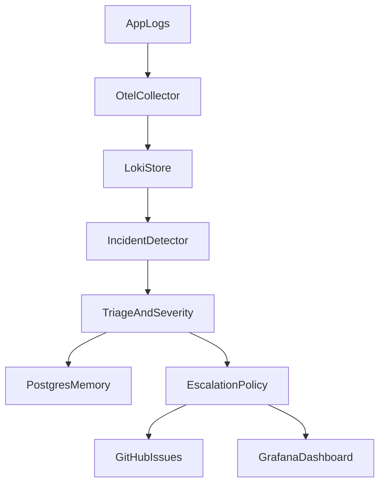
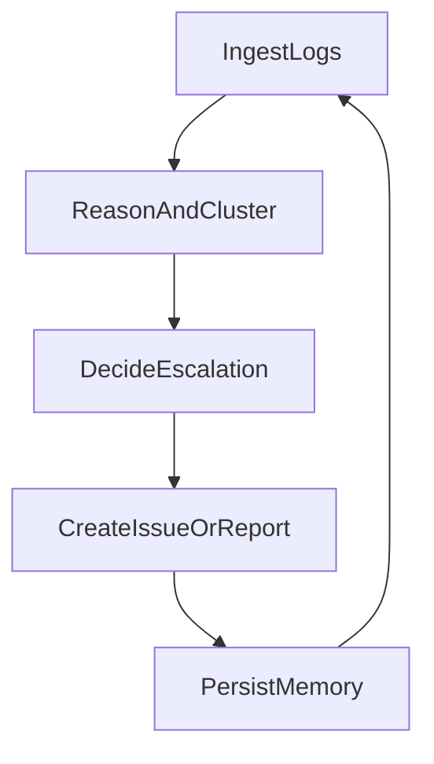

# Incident Orchestration Agent

Reliability-first agent that monitors OpenTelemetry + Loki logs, triages incidents, and escalates to GitHub Issues. Built for production engineering signals: Temporal workflows, Postgres + pgvector memory, and safe tooling.

## Architecture



## Agent Loop



## Reliability Engineering

- **Retry strategy:** Temporal retries for transient failures + local backoff for API calls.
- **Failure cases:** missing GitHub token, Loki outage, Postgres unavailable, malformed logs.
- **Safety:** auto-escalation thresholds + manual approval mode.

## Evaluation Metrics

- Mean time to detect (MTTD)
- Incident precision/recall
- False positive rate
- Escalation latency

## Tech Stack

- TypeScript + Node.js
- Temporal workflows
- Postgres + pgvector
- OpenTelemetry + Loki + Grafana
- OpenAI/Anthropic APIs (optional for enrichment)

## Quickstart

1. Copy `.env.example` to `.env` and set credentials.
2. Start everything with Docker:
   ```
   npm run dev:all
   ```
3. Run one incident sweep (from your host terminal):
   ```
   npm run run
   ```

### Local (no Docker) mode

```
npm run dev:stack
npm run dev:demo
npm run dev:agent
npm run run
```

## License

MIT
# incident-orchestration-agent
