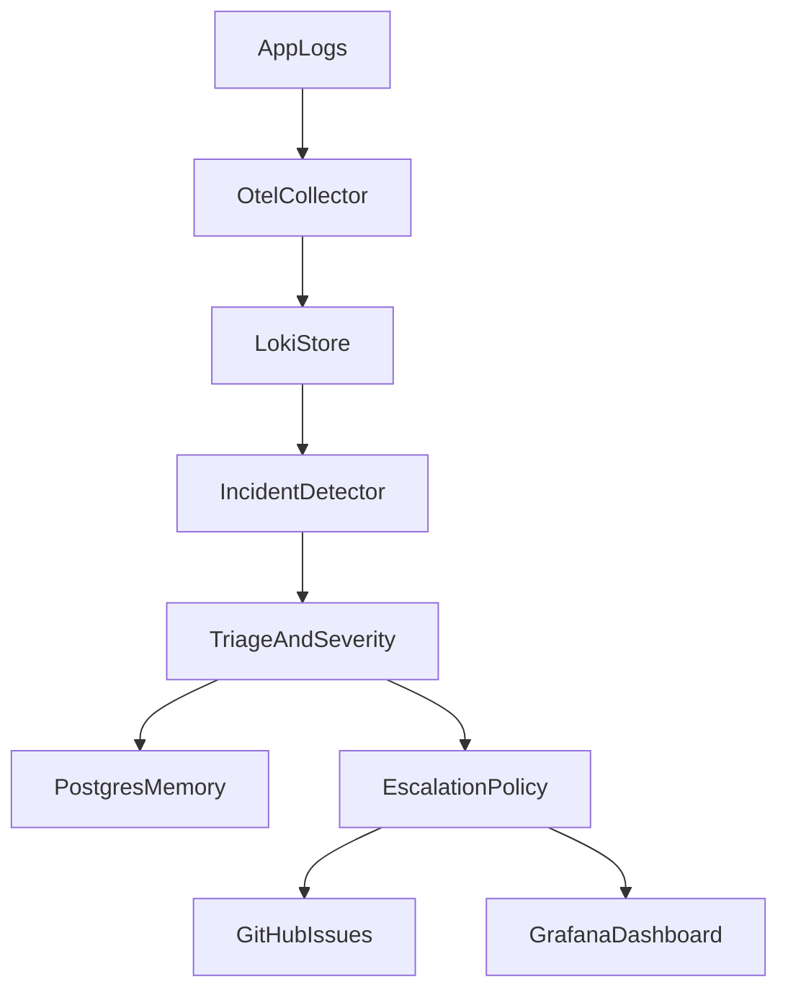
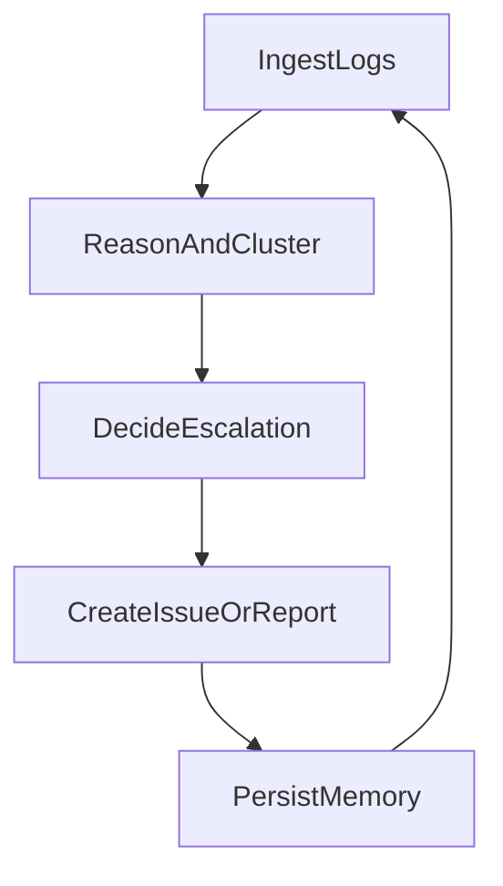

# Incident Orchestration Agent

[](https://github.com/rutvij26/incident-orchestration-agent/actions/workflows/ci.yml)
[](https://github.com/rutvij26/incident-orchestration-agent/blob/main/LICENSE)

Reliability-first agent that monitors OpenTelemetry + Loki logs, triages incidents, and escalates to GitHub Issues. Built for production engineering signals: Temporal workflows, Postgres + pgvector memory, and safe tooling.

## Architecture



## Agent Loop



## Reliability Engineering

- **Retry strategy:** Temporal retries for transient failures + local backoff for API calls.
- **Failure cases:** missing GitHub token, Loki outage, Postgres unavailable, malformed logs.
- **Safety:** auto-escalation thresholds + manual approval mode.

## Evaluation Metrics

- Mean time to detect (MTTD)
- Incident precision/recall
- False positive rate
- Escalation latency

## Tech Stack

- TypeScript + Node.js
- Temporal workflows
- Postgres + pgvector
- OpenTelemetry + Loki + Grafana
- OpenAI/Anthropic/Gemini APIs (optional for enrichment)

## Quickstart

1. Copy `.env.example` to `.env` and set credentials.
2. Start everything with Docker:
   ```
   npm run dev:all
   ```
3. Run one incident sweep (from your host terminal):
   ```
   npm run run
   ```
4. Run healthcheck and tests:
   ```
   npm run healthcheck
   npm run test
   ```

### LLM Enrichment (optional)

Provide one provider and set `LLM_PROVIDER` to select which to use:

```
LLM_PROVIDER=auto
OPENAI_API_KEY=...
OPENAI_MODEL=gpt-4o-mini
ANTHROPIC_API_KEY=...
ANTHROPIC_MODEL=claude-3-5-sonnet-20240620
GEMINI_API_KEY=...
GEMINI_MODEL=gemini-1.5-flash
```

When configured, each incident gets an LLM summary, root-cause hypothesis, suggested severity, and recommended next steps in the GitHub issue body.

### Repository targeting (issues + auto-fix)

Set `REPO_URL` to point the agent at a specific GitHub repo for issue creation and auto-fix PRs. If `REPO_URL` is not provided, the agent falls back to `GITHUB_OWNER` + `GITHUB_REPO`.

```
REPO_URL=https://github.com/owner/repo
GITHUB_TOKEN=...
```

### Repo RAG (optional)

Index your repo for retrieval-augmented fixes (agent can clone automatically using GitHub config). If `RAG_REPO_PATH` is not set, the agent clones into `RAG_REPO_CACHE_DIR` using `REPO_URL` (or `GITHUB_OWNER/GITHUB_REPO`) and `GITHUB_TOKEN`:

```
RAG_REPO_PATH=/path/to/your/repo
RAG_REPO_CACHE_DIR=.agentic/repos
RAG_REPO_REFRESH=pull
REPO_URL=https://github.com/owner/repo
EMBEDDING_PROVIDER=auto
EMBEDDING_MODEL=text-embedding-3-small
EMBEDDING_DIM=1536
RAG_TOP_K=6
```

Then run:

```
npm run rag:index
```

The indexer is idempotent: it skips re-embedding if the repo HEAD has not changed.

Refresh the cache without indexing:

```
npm run rag:refresh
```

### Auto-fix PRs (optional)

Enable auto-fix and point the agent at a local repo checkout (or let it clone):

```
AUTO_FIX_MODE=on
AUTO_FIX_SEVERITY=all
AUTO_FIX_REPO_PATH=/path/to/your/repo
AUTO_FIX_TEST_COMMAND=npm run test
AUTO_FIX_INSTALL_COMMAND=npm install --include=dev
AUTO_FIX_SANDBOX_IMAGE=node:20-slim
GITHUB_DEFAULT_BRANCH=main
```

Auto-fix runs a sandboxed test command before creating a PR and links the incident issue.
Auto-fix only runs for incidents that are escalated to issues. Set `AUTO_ESCALATE_FROM=low` if you want auto-fix for all severities.
When running in Docker, auto-fix requires the Docker socket mounted into the agent container and a bind mount for `./.agentic/repos`.
In Docker, the agent starts the worker only. Run `npm run rag:index` manually when you want to (the indexer skips if the repo HEAD hasn't changed).

### Local (no Docker) mode

```
npm run dev:stack
npm run dev:demo
npm run dev:agent
npm run run
```

## License

MIT

## Docs

- Deployment guide: `docs/deployment-guide.md`
- Functionality flows: `docs/functional-flows.md`
- Pricing estimates: `docs/pricing-estimates.md`

## Contributing

See `CONTRIBUTING.md` for setup and contribution guidelines.

## Security

See `SECURITY.md` for reporting vulnerabilities.

## CI

GitHub Actions runs healthchecks and tests on every push/PR.

## Dashboards

Grafana auto-provisions an "Incident Overview" dashboard with demo log panels.
