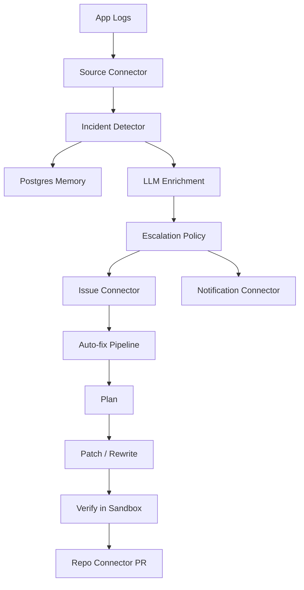
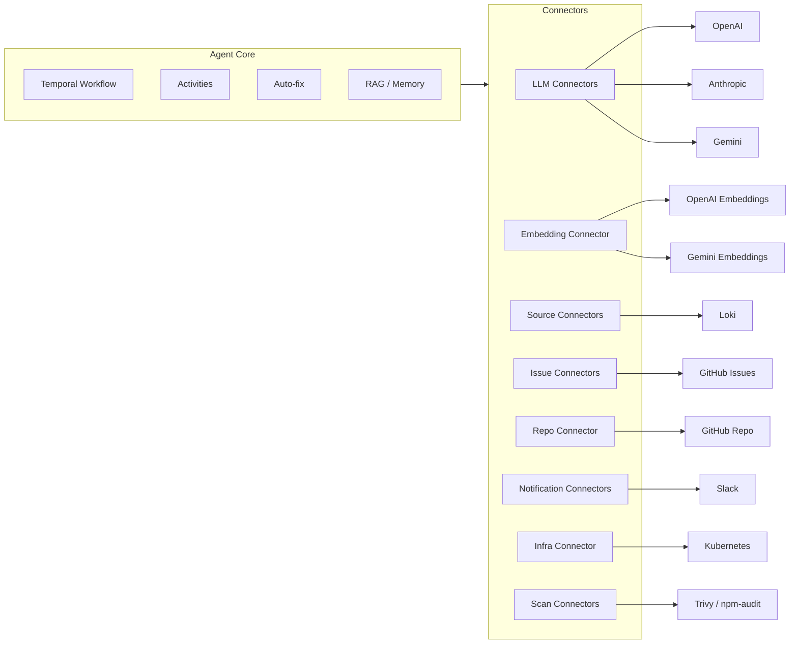

# Agentic — SRE Jarvis

[](https://github.com/rutvij26/incident-orchestration-agent/actions/workflows/ci.yml)
[](https://github.com/rutvij26/incident-orchestration-agent/blob/main/LICENSE)

An autonomous SRE agent that monitors logs, triages incidents, opens GitHub Issues, and raises auto-fix pull requests — all without human intervention. The long-term goal is a plug-and-play SRE co-pilot any engineering team can drop into their stack: swap in your log backend, issue tracker, notification channel, LLM provider, or infra platform by adding a connector, with zero changes to the core agent logic.

---

## How it works


```mermaid
flowchart TD
  appLogs[App Logs] --> sourceConnector[Source Connector]
  sourceConnector --> detector[Incident Detector]
  detector --> memory[Postgres Memory]
  detector --> llm[LLM Enrichment]
  llm --> policy[Escalation Policy]
  policy --> issueConnector[Issue Connector]
  policy --> notifyConnector[Notification Connector]
  issueConnector --> autofix[Auto-fix Pipeline]
  autofix --> plan[Plan]
  plan --> patch[Patch / Rewrite]
  patch --> verify[Verify in Sandbox]
  verify --> repoConnector[Repo Connector PR]
```

Every integration point is a typed **connector**. Switch providers by changing an env var, not your code.

---

## Connector architecture


```mermaid
flowchart LR
  subgraph core [Agent Core]
    workflow[Temporal Workflow]
    activities[Activities]
    autofix[Auto-fix]
    rag[RAG / Memory]
  end

  subgraph connectors [Connectors]
    llmConn[LLM Connectors]
    embConn[Embedding Connector]
    srcConn[Source Connectors]
    issueConn[Issue Connectors]
    repoConn[Repo Connector]
    notifyConn[Notification Connectors]
    infraConn[Infra Connector]
    scanConn[Scan Connectors]
  end

  core --> connectors
  llmConn --> openai[OpenAI]
  llmConn --> anthropic[Anthropic]
  llmConn --> gemini[Gemini]
  embConn --> openaiEmb[OpenAI Embeddings]
  embConn --> geminiEmb[Gemini Embeddings]
  srcConn --> loki[Loki]
  issueConn --> github[GitHub Issues]
  repoConn --> githubRepo[GitHub Repo]
  notifyConn --> slack[Slack]
  infraConn --> k8s[Kubernetes]
  scanConn --> trivy[Trivy / npm-audit]
```

| Connector type | Cardinality | Behaviour |
|---|---|---|
| `LlmConnector` | Ordered list | `withFallback()` — try first, fall back on error |
| `EmbeddingConnector` | Single | Direct call |
| `SourceConnector` | Many | `aggregateLogs()` — parallel query + deduplicate |
| `IssueConnector` | Many | `fanOut()` — parallel fire-and-forget |
| `RepoConnector` | Single | Direct call |
| `NotificationConnector` | Many | `fanOut()` — parallel fire-and-forget |
| `InfraConnector` | Single | Direct call |
| `ScanConnector` | Many | `fanOut()` — parallel fire-and-forget |

---

## Auto-fix pipeline

Each incident that meets the severity threshold goes through a three-step LLM loop before a PR is raised:

1. **Plan** — LLM identifies which files to touch and what approach to take. Grounded with `git ls-files` to prevent path hallucinations.
2. **Patch / Rewrite** — LLM generates a unified diff or a full file rewrite. Full current file content is fed back to the LLM so boilerplate is preserved.
3. **Verify** — LLM reviews its own patch. Tests run inside a Docker sandbox; the PR is only raised if tests pass.

RAG context is scoped to the relevant subdirectory via `RAG_REPO_SUBDIR` to keep retrieval signal high in monorepos.

---

## Tech stack

| Layer | Technology |
|---|---|
| Orchestration | [Temporal](https://temporal.io) workflows + activities |
| Memory | Postgres + [pgvector](https://github.com/pgvector/pgvector) |
| Observability | OpenTelemetry + Loki + Grafana |
| LLM | OpenAI / Anthropic / Gemini (pluggable via connectors) |
| Sandbox | Docker (`node:20-slim`) |
| Language | TypeScript / Node.js 20 |
| Tests | Vitest (100% coverage on agent + business logic) |

---

## Quickstart

### Prerequisites

- Docker + Docker Compose
- Node.js 20+
- At least one LLM API key (OpenAI, Anthropic, or Gemini)

### 1. Configure

```bash
cp .env.example .env
# Set OPENAI_API_KEY (or ANTHROPIC_API_KEY / GEMINI_API_KEY)
# Set GITHUB_TOKEN, GITHUB_OWNER, GITHUB_REPO for issue creation
```

### 2. Start the full stack

```bash
npm run dev:all
```

This starts Temporal, Postgres, Loki, Grafana, the demo service, and the agent worker.

### 3. Trigger an incident sweep

```bash
npm run run
```

### 4. Run tests

```bash
npm run test
npm run healthcheck
```

---

## Configuration reference

### LLM providers

```env
# Legacy single-provider selection (still supported)
LLM_PROVIDER=auto              # auto | openai | anthropic | gemini

# New: comma-separated fallback chain (overrides LLM_PROVIDER when set)
# LLM_CONNECTORS=openai,anthropic

OPENAI_API_KEY=
OPENAI_MODEL=gpt-4o-mini
ANTHROPIC_API_KEY=
ANTHROPIC_MODEL=claude-3-5-sonnet-20240620
GEMINI_API_KEY=
GEMINI_MODEL=gemini-1.5-flash
```

When `LLM_CONNECTORS=openai,anthropic` is set and the OpenAI call fails, the agent automatically retries with Anthropic.

### Embedding / RAG

```env
EMBEDDING_PROVIDER=auto        # auto | openai | gemini | none
# EMBEDDING_CONNECTOR=gemini   # optional override

EMBEDDING_MODEL=text-embedding-3-small
EMBEDDING_DIM=1536
RAG_TOP_K=6
RAG_MIN_SCORE=0.2
RAG_REPO_CACHE_DIR=.agentic/repos
RAG_REPO_REFRESH=pull

# Monorepo: scope the RAG indexer to a subdirectory
# RAG_REPO_SUBDIR=apps/my-service
```

Index the repo:

```bash
npm run rag:index
```

The indexer is idempotent — it skips chunks whose content hash has not changed.

### Auto-fix PRs

```env
AUTO_FIX_MODE=on
AUTO_FIX_SEVERITY=all          # low | medium | high | critical | all
AUTO_FIX_BRANCH_PREFIX=agentic-fix
AUTO_FIX_TEST_COMMAND=npm run test
AUTO_FIX_INSTALL_COMMAND=npm install --include=dev
AUTO_FIX_SANDBOX_IMAGE=node:20-slim
AUTO_FIX_MIN_SCORE=0.5         # minimum fixability score to attempt a fix
AUTO_FIX_SKIP_AFTER_FAILURES=1

GITHUB_TOKEN=
GITHUB_OWNER=
GITHUB_REPO=
GITHUB_DEFAULT_BRANCH=main
```

> When running in Docker, auto-fix requires the Docker socket mounted into the agent container and a bind mount for `./.agentic/repos`. See `docs/deployment-guide.md`.

### Escalation + notifications

```env
AUTO_ESCALATE_FROM=high        # low | medium | high | critical | none
```

---

## Repository layout

```
packages/
  agent/
    src/
      connectors/          # Pluggable connector layer
        llm/               # LlmConnector — OpenAI, Anthropic, Gemini
        embedding/         # EmbeddingConnector — OpenAI, Gemini
        source/            # SourceConnector interface (Loki in M5)
        registry.ts        # Resolvers + fanOut / withFallback / aggregateLogs
      activities/          # Temporal activities (incidents, escalation)
      autofix/             # Plan → patch → verify pipeline
      lib/                 # Config, LLM orchestration, GitHub, Loki, types
      memory/              # Postgres + pgvector memory layer
      rag/                 # Repo indexing + retrieval
      tools/               # Docker sandbox
      workflows/           # Temporal workflow definitions
apps/
  demo-services/           # Instrumented Express app for local demos
docs/
  milestone-checklist.md   # Detailed milestone tracker
  deployment-guide.md
  functional-flows.md
  pricing-estimates.md
```

---

## Roadmap

Progress tracked in [`docs/milestone-checklist.md`](docs/milestone-checklist.md).

| # | Milestone | Status |
|---|---|---|
| — | RAG Isolation + Incremental Indexing | ✅ |
| — | Auto-fix Decision Scoring | ✅ |
| — | Prompt Architecture Hardening (plan→patch→verify, LLM grounding) | ✅ |
| 4 | Connector Foundation — LLM + Embedding connectors, registry, multi-provider helpers | ✅ |
| 5 | Source Connectors — migrate Loki, `aggregateLogs()` fan-out | |
| 6 | Issue + Repo Connectors — split GitHub lib, `fanOut()` for multi-tracker | |
| 7 | Notification Connectors — Slack, PagerDuty, generic webhook | |
| 8 | Sandbox Reliability — resource limits, network allowlist, branch locks | |
| 9 | Cost Controls + Telemetry — token usage logging, LLM budget caps | |
| 10 | Governance + Approval — human-in-the-loop approval for high-risk fixes | |
| 11 | InfraConnector — Kubernetes restart / scale / rollback | |
| 12 | Multi-Service Monitoring — fan-out workflow across monitored services | |
| 13 | Scan Connectors — npm-audit, Trivy vulnerability scanning | |
| 14 | Self-Learning Feedback Loop — outcome tracking, recurrence detection | |
| 15 | Web Portal — self-hosted control plane for connector config + live controls | |

---

## Local (no Docker) mode

```bash
npm run dev:stack    # Temporal + Postgres + Loki + Grafana
npm run dev:demo     # Demo service
npm run dev:agent    # Agent worker
npm run run          # One incident sweep
```

---

## Docs

- [Deployment guide](docs/deployment-guide.md)
- [Functional flows](docs/functional-flows.md)
- [Pricing estimates](docs/pricing-estimates.md)
- [Milestone checklist](docs/milestone-checklist.md)

## Contributing

See [`CONTRIBUTING.md`](CONTRIBUTING.md) for setup and contribution guidelines.

## Security

See [`SECURITY.md`](SECURITY.md) for reporting vulnerabilities.

## License

MIT
