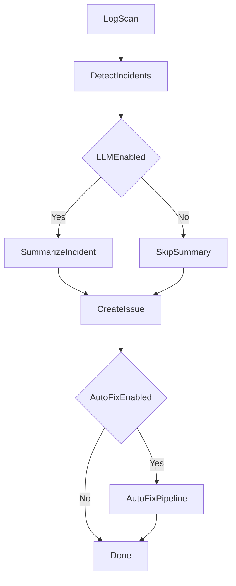
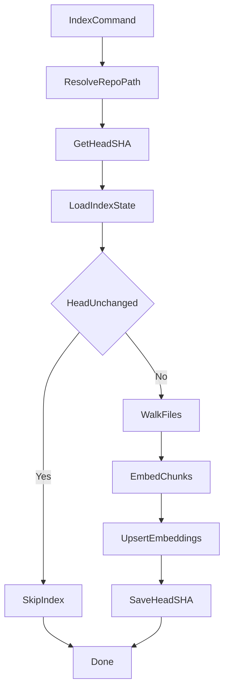
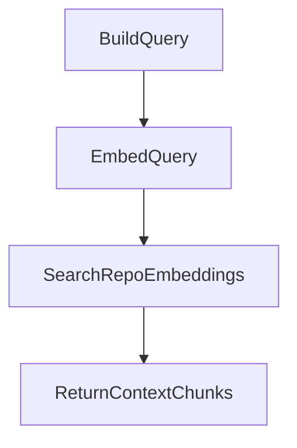
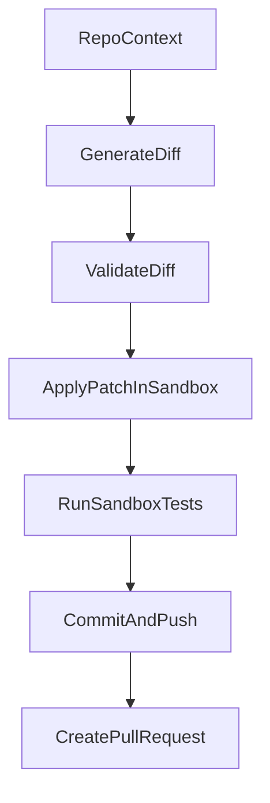

## Functionality Flows

This document outlines the main runtime flows for detection, indexing, retrieval, and auto-fix.

### Incident detection and issue creation

Notes:
- Issue creation targets `REPO_URL` if set, otherwise `GITHUB_OWNER/GITHUB_REPO`.
- LLM enrichment is optional and depends on `LLM_PROVIDER` + provider API keys.

### Repository indexing (RAG)

Notes:
- Indexing uses `RAG_REPO_PATH`, else clones using `REPO_URL` or `GITHUB_OWNER/GITHUB_REPO`.
- If the repo HEAD has not changed and embeddings exist, indexing is skipped.

### Retrieval for auto-fix

Notes:
- Retrieval calls embeddings once per query.
- The top `RAG_TOP_K` chunks are sent to the fix proposal generator.

### Auto-fix pipeline

Notes:
- If the diff fails to apply, the system may fall back to a rewrite (if enabled).
- Auto-fix requires repo write access and `GITHUB_TOKEN`.
